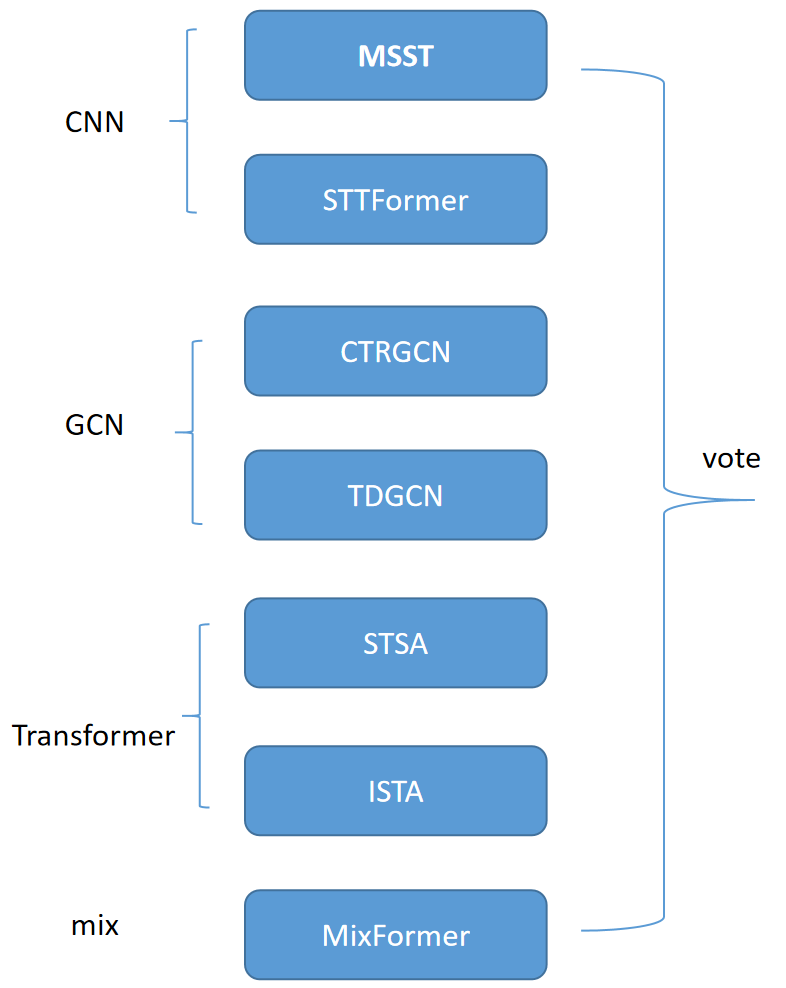
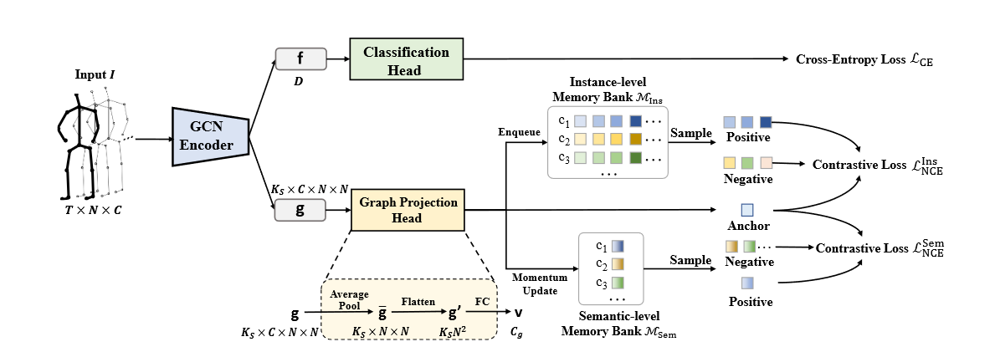
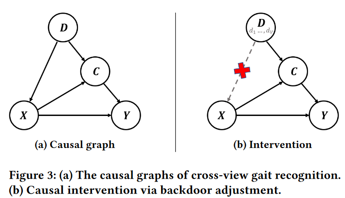
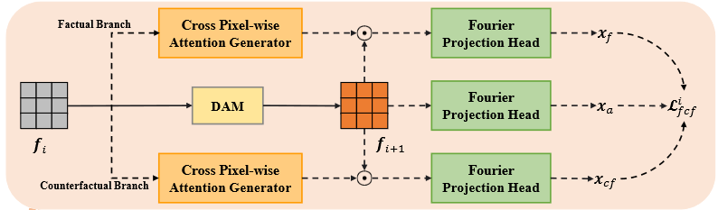

# 无人机行为识别

- 用法

    `sh scripts/[_model you choose_].sh`
- CKPT and LOG

    [点击下载](https://pan.baidu.com/s/1KOF0mKGaATm1O0DLV3yhdw?pwd=4bfi)
  链接: https://pan.baidu.com/s/1KOF0mKGaATm1O0DLV3yhdw?pwd=4bfi 提取码: 4bfi 复制这段内容后打开百度网盘手机App，操作更方便哦

## 算法说明

### 混合专家机制（Mixed Expert Models）

受到混合专家模型的启发。我们通过多个不同结构和模态的网络来学习动作识别表示中的不同分布。
从模型的结构分析，基于CNN的模型具有快速识别具有高速特性的动作的能力，基于GCN的模型能够捕捉时间缓慢的相关位置动作变化，而基于Transformer的模型在建模长程动作时具有优势。

基于这种假设，我们挑选了以下7个模型进行训练，他们在不同动作上具有如上所述的不同分布。根据投票机制，在混合使用时，多个专家模型能够稀释由单个网络结构学习到的动作偏差，从而产生更加鲁棒性的效果。

同时，经过实验发现，在joint与bone模态上，模型具有更强的表示能力与区分度。我们同时在joint cat bone模态上进行了实验。在这种混合模态的情况下，模型学习到了基于两者的交集与并集的信息。从而产生了与单个模态不同的表示，进而提高了模型的区分度。

- STT[(Spatial-Temporal Transformer for Skeleton-based Action Recognition)](https://arxiv.org/abs/2201.02849)
- MSST[(Multi-scale spatial–temporal convolutional neural network for skeleton-based action recognition)](https://ieeexplore.ieee.org/document/9404175)
- CTR-GCN[(Channel-wise Topology Refinement Graph Convolution for Skeleton-Based Action Recognition)](https://arxiv.org/abs/2107.12213)
- TD-GCN[(Temporal Decoupling Graph Convolutional Network for Skeleton-Based Gesture Recognition)](https://ieeexplore.ieee.org/document/10113233)

- STSA[(Spatio-Temporal Self-Attention Network for Video Saliency Prediction)](https://www.sciencedirect.com/science/article/pii/S0925231222013716)
- ISTA[(Interactive Spatiotemporal Token Attention Network for Skeleton-based General Interactive Action Recognition)](https://ieeexplore.ieee.org/document/10342472)

- MIX[(HDBN: A Novel Hybrid Dual-Branch Network for Robust Skeleton-Based Action Recognition)](https://ieeexplore.ieee.org/document/10645450)

### 图对比学习（Graph Contrastive Learning）

在基于骨架的行为识别领域，目前表现最好的图卷积网络利用序列内上下文构建自适应图进行特征聚合。然而，我们认为这样的背景仍然是局部的，因为丰富的交叉序列关系没有被明确地研究过。我们使用了一个基于骨架的动作识别的图对比学习[(Graph Contrastive Learning for Skeleton-based Action Recognition)](https://arxiv.org/abs/2301.10900)来探索所有序列的全局上下文。GCL通过强制图具有类区分性，即类内紧凑和类间分散，来关联跨序列的图学习，从而提高GCN区分各种动作模式的能力。此外，还设计了两个记忆库来丰富交叉序列的结论。

其核心思想是将来自同一类别的学习图拉在一起，同时将来自不同类别的学习图推开。由于图可以揭示序列的动作模式，加强图在同一类中的一致性和不同类之间的不一致性有助于模型理解各种运动模式。

在储存Bank中，一个实例级存储体存储了序列级图，这些图保存了每个序列的个体属性。相反，一个语义级的记忆库存储了每个类的图的聚合，其中包含了类级的表示。这两个Bank是互补的，使我们能够利用更多的样本。

我们在基于GCN的模型中使用该方法。

### 因果启发的判别特征学习（Causality-inspired Discriminative Feature Learning）

因果推断是指确定不同因素或事件之间因果关系的过程。我们将因果关系引入到动作识别中，以分离各种混杂因素和分类内在线索。
动作识别中不同变量之间的因果关系可以用下图所示的结构因果模型( Structural Causal Model，SCM )来描述。我们的SCM检查关键组件之间的因果关系：骨架序列X，动作标签Y，潜在表示C，混杂因素D。

受到[(Causality-inspired Discriminative Feature Learning in Triple Domains for Gait Recognition)](https://arxiv.org/abs/2407.12519)启发。我们从步态识别的相关研究获得启发，将因果推断的想法与卷积神经网络结合。在我们的基于卷积的模型中。我们使用了上文提出的CPAG模块来学习事实推断和反事实推断，通过无偏场景图生成的因果推断中的总直接效应( Total Direct Effect，TDE )来减轻上下文偏差。从而有

- $Y f = P(Y |X = xf )$
- $Y cf = P(Y |do(X = xcf ))$
- $TDE = Y f − Y cf$

我们通过最大化TDE和事实概率来消除混杂因素的影响。这个模块仅在训练时加入以增强通道间的特征表示并在测试时移除。
我们在基于CNN的模型中使用该方法。

